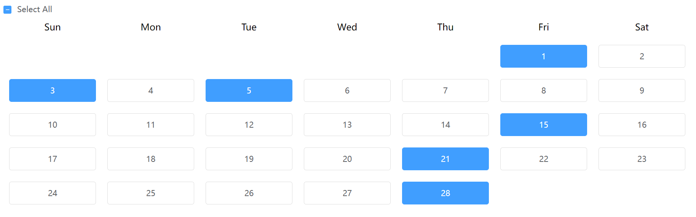

# ImmenseCalendar
*   
  * base on Element-UI
  * 基于Element-UI开发
  * Element-UIに基づいて
  * Element-UI를 기반으로
*   
  * an immense calendar support selecting days one by one
  * 一个可以逐天操作日期的大日历
  * 日を1日に操作できるカレンダー
  * 날를 하루에 조작할 수 있는 캘린더
*   
  * the component is at ImmenseCalendar/src/components/calendar.vue
  * 组件位于ImmenseCalendar/src/components/calendar.vue
  * コンポーネントはImmenseCalendar/src/components/calendar.vueにあります
  * 요소는 ImmenseCalendar/src/components/calendar.vue에 있습니다
*   
  * the usage is at ImmenseCalendar/src/App.vue
  * 用法位于ImmenseCalendar/src/App.vue
  * 使用法はImmenseCalendar/src/App.vueにあります
  * 사용법은 ImmenseCalendar/src/App.vue에 있습니다
*   
  * custom variable
  * @param {number} year - the year to show
  * @param {number} month - the month to show
  * @param {string} lang - interface language, 'EN','JP','KO' are available, and other values lead to Chinese
  * @param {array} selectedDays - selectedDays, begin from 1, both number array and string array are available
  * @param {number} buttonWidth - each width of a day button
  * @param {boolean} disabled - if is disabled, true lead to disabled and other values lead to false
  * @function onChange - return selected days list
  * @function disabledDays - use callback funtion to mark disabled days, need to return a boolean value

